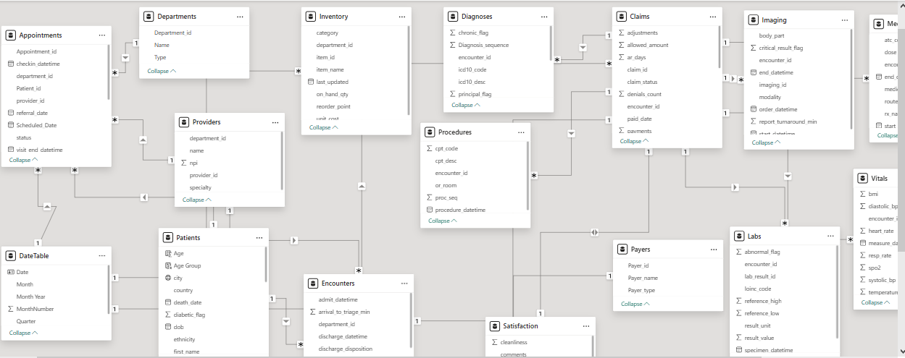
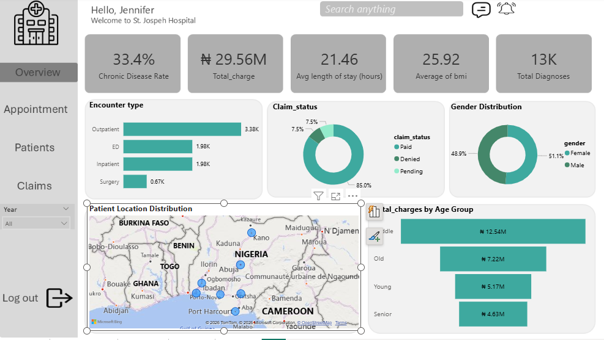
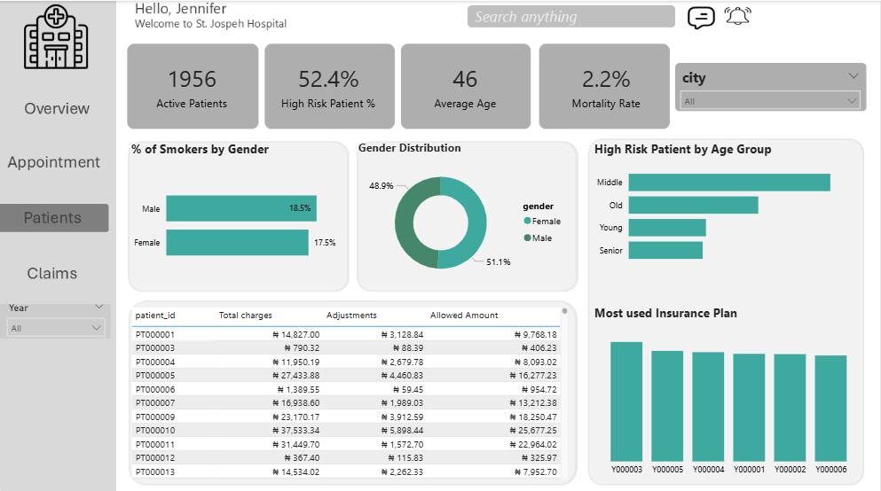
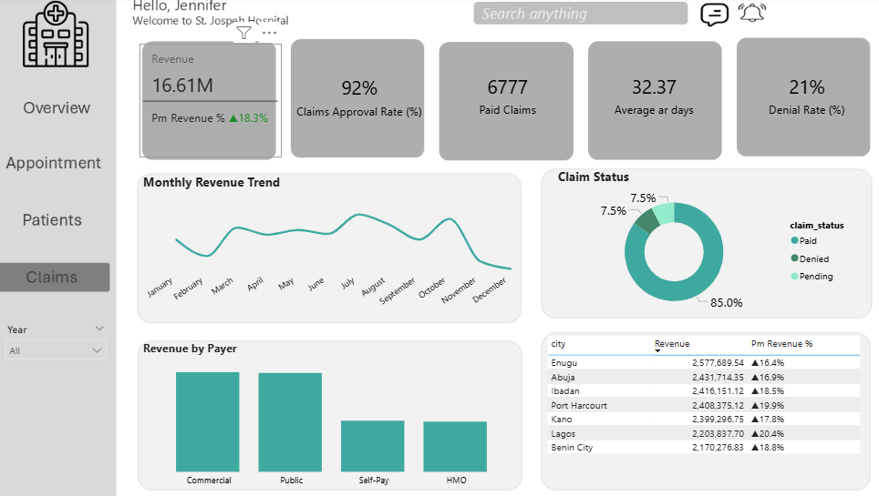

# St.-Joseph-s-Hospital-Analysis

___
## INTRODUCTION
This is a Power BI project on healthcare analysis of an imaginary hospital called **St.Joseph's hospital**. The aim of this project is to analyze and drive insights to answer crucial questions and help the hospital make data driven decisions.
**_Disclaimer_** : _All this dataset and report do not represent any hospital, but just a dataset i used to demonstrate by skills and capabilities of Power BI._

## PROBLEM STATEMENT
1. Hospital leadership needed a single view of financial performance to understand total revenue, revenue growth, and how income varies across months, cities, payer types, and patient age groups.
2. The claims team lacked clear visibility into approval rates, denial rates, pending claims, and processing timelines, making it difficult to identify revenue leakage and improve cash flow.
3. Care teams needed insight into patient risk levels, mortality rate, and high-risk age groups to support preventive care planning and better resource allocation.
4. The hospital had limited understanding of patient demographics and lifestyle risk factors such as smoking, BMI, chronic disease prevalence, and gender distribution.
5. Operations teams needed to understand service utilization across encounter types and patient locations to allocate staff and resources efficiently.
6. Finance and strategy teams required clarity on insurance and payer performance to evaluate reimbursement efficiency and identify the most valuable insurance partners.

## SKILL

The following Power Bi features were incorporated:
- DAX,
- Modelling,
- Silicers
## MODELLING:
Automatically derived relationships are adjusted to remove and replace unwanted relationships with the required.

 Model
:--------:

The model is a star schema.
There are 5-dimension tables and 1 fact table. The dimension tables are joined to the facts table with one-many relationship
## VISUALIZATION
The report comprises 4 pages:
1. Overview 
2. Patient 
3. Appointment 
4. Claims 

## ANALYSIS:
The hospital has a total of 2,000 patients,
of which 1956 of them are active patient, With an average age of 46 years.

## PATIENT:
52.4% of the total patient are High risk patient of which high percentage of them are middle age 
A 2.2% mortality rate

## APPOINTMENT:
We recorded a 15.8% no show rate, 89 completed appointment with average visit duration od 40.35(mins)
ICU has the highes average waiting time by department
Inpatients were the highest appointment volume we recorded.

## CLAIMS:
Total charge of #29.56M and a claim rate of 92%, a denail rate of 21%
About 85% claims have been paid
Middle age are the most cahrged (#12.54M)

## CONCLUSIN AND RECOMMENDATION
- Middle age has the highest number of high risk patient
- There are 1956 active patient with a total revenue of #16.61M
- Abuja and Kano are states with highest number of patients.
  
## RECOMMENDATION
- Implement a 48hr referral follow up protocol
- Create a predictive model for the July appointment surge we saw in the trend data

